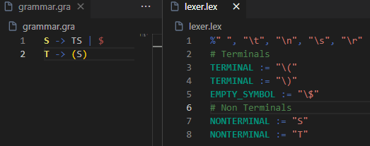

# VSCode Extension for Parssist - A parser assistant

A Parsergenerator, which takes an extended BNF and builds a Parser (with a certain algorithm). 
For now it is only possible to generate a parser written in Java. 
In the future it should be possible to generate parsers in other languages as well. See the [open issues](#open-issues) for more information.

## Getting Started
Basically, Parssist takes a grammar and a lexical definition described [here (grammar)](#grammar-documentation)) and [here (lexer)](#lexer-documentation)). 
Defaultly you can define your grammar in a file called `grammar.gra` and your lexical definition in a file called `lexer.lex` (both should be in the same directory).
You can change the default file names in the settings of the extension [here](#extension-settings).

> For using the [online editor](https://www.parsergenerator.valenzelektron.com/web/parssist.html) read the [GitHub Parssist wiki](https://github.com/avatarluca/parssist/wiki).

## Features

### Generating a Parser
You can generate a parser by pressing `F1` or `Ctrl+Shift+P` (open command palette) and typing `Parssist: Generate parser`. 

Alternatively you can press the  button in the status bar.

### Syntax Highlighting
The extension provides syntax highlighting for the grammar and the lexical definition.

### Extension Settings
You can configure the extension by pressing `F1` or `Ctrl+Shift+P` (open command palette) and typing `Preferences: Open Settings (UI)`. 
Then search for `parssist` and you can change the default file names for the grammar and the lexical definition.

This extension contributes the following settings:
* 'parssist.grammarFile': The default file name for the grammar.
* 'parssist.lexerFile': The default file name for the lexical definition.
* 'parssist.algorithm': The algorithm used for the parser generation. (Currently only `LL(1)` and `SLR(1)` is supported. `auto` will choose the algorithm automatically based on the grammar.)
* 'parssist.language': The language of the generated parser. (Currently only `Java` is supported.)
* 'parssist.name': The name of the generated parser. (Default is `Parser`.)
* 'parssist.moduleName': The package of the generated parser. (Default is `parssist.Parser`.)
* 'parssist.writeLog': If a log file should be written. (Default is `true`.)

## Requirements
For now, the extension only supports the generation of a parser in Java.
So there for you need to have Java installed on your machine.

In addition, Parssist uses [Gradle](https://gradle.org/install/) to build the parser.

## Release Notes
### 1.0.0

Initial release of Parssist.
Date of release: 2024-07-10

## Lexer Documentation
### Introduction
The lexerfile defines the information required for lexical analysis and thus tokenization.
### Explanation
The simplest form of tokenization is based on the help of regex. The symbol groups and the corresponding patterns are mapped together and define the alphabet and the vocabulary of the grammar.
  
To go into the notation of the lexerinput, the operators are described below.
#### := Assignment Operator
The usual form of a lexer definition rule is as follows:
  
`[TOKENNAME] := "[REGEX]"`
  
The tokenname should start on a new line. It is good practice to define this name capslock for clarity.
#### NONTERMINAL
Nonterminal elements should be mapped with the keyword NONTERMINAL to tell the generator which elements are nonterminal. The mapped regex element can be combined individually or as usual with a regex pipe operator.
#### Ignorables
Symbols (such as the empty symbol) may appear in the grammar which have no influence on the parsing. Well-known examples of this are spaces or line breaks. These are called ignorables in Parssist. 
  
To define these elements, you can write a lot with the respective symbols. The notation is as follows:  
`%"[SYMBOL1]", "[SYMBOL2]" [...]`
  
Make sure that the quantities are each defined on a new line. These symbols are then automatically given the label "IGNORE".
#### Comments
In the lexer file there are only line comments that must begin with a hashtag. these are not taken into account during the lexical analysis.

> You can find lexer examples in the [Online Editor](https://www.parsergenerator.valenzelektron.com/web/parssist.html)

## Grammar Documentation
### Introduction
The input grammar format is an easy variation of EBNF. The BNF format used corresponds to the 4-tuple (V, A, P, S). V is a set of non-terminals (vocabulary), A is the alphabet, P the production rules and S the start symbol. 

<b>Basic principle</b> 
It is important that any further modifications to these formats have no influence on the following definitions in order to enforce down-/upward compatibility. Whenever Parssist expands its grammar (and this will often be the case) this rule will be strictly adhered to.

### Explanation of the 4-tuple definition (V, A, P, S)
#### Vocabulary (V)
Non-terminals must begin with a capital letter to show that it is a non-terminal. As soon as it is to the left of the production, this implies the initialization of a non-terminal. As the application therefore automatically knows which symbols have been initialized as non-terminals, it is not necessary to explicitly specify a quantity. Possibly, however, later on in type-1 languages where terminals may also be on the left-hand side.
At the moment all non-terminals have to be defined in the lexer file! There is no auto recognizer yet.
#### Alphabet (A)
The alphabet defines the terminal symbols. These are also defined in the lexer file.
#### Production rules (P)
The syntax of the production rules is defined as follows:  
`NONTERMINAL -> [TERMINAL | NONTERMINAL]`  
The square brackets indicate optional elements and are not part of the syntax.
In order to learn the notation, the operators are now described in more detail.
##### Production Rule Arrow Operator
Production rules are therefore generally declared with an arrow (`->`). It does not matter how many spaces are defined before and after the symbol, but it is important that the arrow symbol is defined together as one symbol.
##### Empty Symbol Operator
The empty symbol, which is normally marked as an epsilon, is marked with a dollar sign (`$`).
##### Pipe Operator
In the example above you can see that production rules are not limited to just one definition rule. This is a modification that we use to avoid defining the syntax unnecessarily long. The pipe symbol (`|`) indicates the other rules.
#### Startsymbol (S)
At the moment, the first non-terminal definition symbol is automaticaly used as the start symbol.

> You can find grammar examples in the [Online Editor](https://www.parsergenerator.valenzelektron.com/web/parssist.html)

## Open Issues
Parssist is still in development and there are many open issues.
The top priority is to implement the following features:
* LR-Parser generation
* Error recovery
* Add semantic predicates
* More languages for the generated parser
* Handling Spaces and other cases in input

> If you find any bugs or have any feature requests, please open an issue on the [GitHub page](https://github.com/avatarluca/parssist/issues).

## For more information

* [Parssist GitHub](https://github.com/avatarluca/parssist)
* [Parssist Online Editor](https://www.parsergenerator.valenzelektron.com/web/parssist.html)

**Thank you for reading. I hope you enjoy using Parssist!**